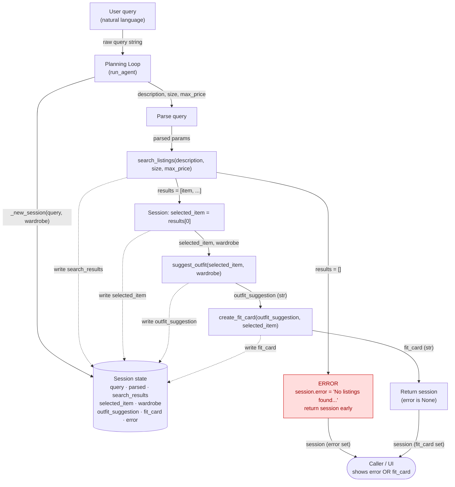

# FitFindr — planning.md

> Complete this document before writing any implementation code.
> Your spec and agent diagram are what you'll use to direct AI tools (Claude, Copilot, etc.) to generate your implementation — the more specific they are, the more useful the generated code will be.
> Your planning.md will be reviewed as part of your submission.
> Update it before starting any stretch features.

---

## Tools

List every tool your agent will use. For each tool, fill in all four fields.
You must have at least 3 tools. The three required tools are listed — add any additional tools below them.

### Tool 1: search_listings

**What it does:**
Search listings is a function that looks through the listings dataset for items matching the description, optional size, and optional price ceiling. 

**Input parameters:**
- `description` (str): keyword describing what the user is looking for
- `size` (str): size string to filter by or 'None' to skip size filter. Note: Matching is case-INsensitive
- `max_price` (float): Maximum price, or 'None' to skip size filter. Note: Price is INclusive

**What it returns:**
This function will return a list of dictionaries list[dict] of matching listings, sorted by relevance with the best matching returned first. Here, relevance is defined as a score = number of keywords from description (lowercased, split on whitespace) that appear in the listing's title + description + style_tags. Listings scoring 0 are dropped. Ties broken by lower price. 

A list of listing dicts sorted by relevance, best match first. Each dict has keys: id (str), title (str), description (str), category (str: tops/bottoms/outerwear/shoes/accessories), style_tags (list[str]), size (str), condition (str: excellent/good/fair), price (float), colors (list[str]), brand (str or None), platform (str: depop/thredUp/poshmark)."

**What happens if it fails or returns nothing:**
If nothing mathces, returns an empty list. Note: does NOT raise an exception.
---

### Tool 2: suggest_outfit

**What it does:**
Given a thrifted item and the user's wardrobe, this function should suggest 1-2 complete outfits. 

new_item: a listing dict with the keys listed in Tool 1. wardrobe: a dict with one key items, a list of wardrobe-item dicts; each has id, name (str), category, colors (list[str]), style_tags (list[str]), notes (str or None).

This function calls the Groq LLM _get_groq_client().

**Input parameters:**
- `new_item` (dict): A listing dictionary (the item the user is considering buying)
- `wardrobe` (dict): A wardrobe dictionary with an 'items' key that contains a list of wardrobe item dictionaries. This entry cnaa be empty. 

**What it returns:**
This returns a non-empty string with outfit suggestions. 

**What happens if it fails or returns nothing:**
If the wardrobe is empty, the return value should offer general styling advice for the item, rather than raising an exception or returning an empty string. 

---

### Tool 3: create_fit_card

**What it does:**
This function generates a short, shareable outfit caption for the thrifted find.

Specifically, around 2–4 sentences and mentions item title, price, and platform once each; casual OOTD tone; higher LLM temperature so output varies.

**Input parameters:**
- `outfit` (string): The outfit suggestion string from suggest_outfit().
- `new_item` (dict) : The listing dictionary for the thrifted item. 

**What it returns:**
This function returns a 2-4 sentence string usable as an Instagram/TikTok caption. 

**What happens if it fails or returns nothing:**
If the outfit caption is empty or missing, return a descriptive error message string. Note: do NOT raise an exception. 

---

### Additional Tools (if any)

<!-- Copy the block above for any tools beyond the required three -->

---

## Planning Loop

**How does your agent decide which tool to call next?**
The loop is a fixed sequential pipeline, not an intent classifier. It runs every stage in order, passing state through the session dict, and branches only on failure.

1. Initialize session = _new_session(query, wardrobe).
2. Parse the query into description, size, max_price; store in session["parsed"]. (State which method: regex / string-split / LLM.) Branch: if no usable description is extracted, set session["error"] = "I couldn't tell what you're looking for — try describing the item." and return session.
3. Search: results = search_listings(description, size, max_price); store in session["search_results"]. Branch: if results == [], set session["error"] = "No listings matched — try removing the size or raising your price." and return session (do not proceed). In other words: If the list is empty → set session["error"] = "No vintage graphic tees under $30 in size M right now — try raising your price or dropping the size filter." and return session immediately. Do not call suggest_outfit.
If the list is non-empty → set session["selected_item"] = results[0] and continue to Step 2.
4. Select: session["selected_item"] = results[0] (top-ranked).
5. Suggest: session["outfit_suggestion"] = suggest_outfit(selected_item, wardrobe). Branch: if it returns an empty/whitespace string, set session["error"] and return (or substitute a fallback string — pick one and document it).
6. Caption: session["fit_card"] = create_fit_card(outfit_suggestion, selected_item). This always returns a string (an error string on bad input), so store it as-is.
7. Return session. Success = session["error"] is None. 

---

## State Management

**How does information from one tool get passed to the next?**
<!-- Describe how your agent stores and accesses state within a session. What data is tracked? How is it passed between tool calls? -->
State lives in the session dict from _new_session(). Each stage reads the field the previous stage wrote (parsed → search_results → selected_item → outfit_suggestion → fit_card) and error short-circuits the rest.

---

## Error Handling

For each tool, describe the specific failure mode you're handling and what the agent does in response.

| Tool | Failure mode | Agent response |
|------|-------------|----------------|
| search_listings | No results match the query | Empty list, does not raise exception|
| suggest_outfit | Wardrobe is empty | Offers general styling advice (avoids raising exception or returning empty string)|
| create_fit_card | Outfit input is missing or incomplete | Returns descriptive error message string, does not raise exception|

---

## Architecture

<!-- Draw a diagram of your agent showing how the components connect:
     User input → Planning Loop → Tools (search_listings, suggest_outfit, create_fit_card)
                                                                          ↕
                                                                   State / Session
     Show what triggers each tool, how state flows between them, and where error paths branch off.
     ASCII art, a Mermaid diagram (https://mermaid.js.org/syntax/flowchart.html), or an embedded
     sketch are all fine. You'll share this diagram with an AI tool when asking it to implement
     the planning loop and each individual tool. -->

**How to read it:** Solid arrows show the main control/data flow; arrow labels name the data passed. Dotted arrows show each tool writing its result back into the `Session` store. The red **ERROR** node is the early-termination branch: if `search_listings` returns `[]`, the loop sets `session["error"]`, skips `suggest_outfit` and `create_fit_card` entirely, and returns. Both the error path and the success path converge on the caller, which checks `session["error"]` to decide whether to display the error message or the finished fit card.

---

## AI Tool Plan

<!-- For each part of the implementation below, describe:
     - Which AI tool you plan to use (Claude, Copilot, ChatGPT, etc.)
     - What you'll give it as input (which sections of this planning.md, your agent diagram)
     - What you expect it to produce
     - How you'll verify the output matches your spec before moving on

     "I'll use AI to help me code" is not a plan.
     "I'll give Claude my Tool 1 spec (inputs, return value, failure mode) and ask it to implement
     search_listings() using load_listings() from the data loader — then test it against 3 queries
     before trusting it" is a plan. -->

**Milestone 3 — Individual tool implementations:**
For search_listings, I'll give Claude the Tool 1 block from planning.md (inputs, return value, failure mode) and ask it to implement the function using load_listings() from the data loader. Before running it, I'll check that the generated code filters by all three parameters and handles the empty-results case. Then I'll test it with 3 queries.

For suggest_outfit(), I'll give claude the tool 2 block (both input dictionary shapes, return value, the empty-wardrobe failure models) and ask it to implement the function suggest_outfit(). Before running it, I'll make sure it branches on wardrobe["items"] being empty vs non-empty, that the non-empty branch actually formats the wardrobe items into a prompt, and that it returns a str and never raises on an API error when calling _get_groq_client(). Then I'll test it with three prompts checking properties like: 
1. real item + example wardrobe → non-empty string that names at least one wardrobe piece (e.g. "baggy jeans", "chunky sneakers").
2. real item + get_empty_wardrobe() → non-empty string giving general advice, no wardrobe pieces named.
3. run the same input twice → confirm it doesn't crash and stays on-topic (output may differ — that's fine).

For create_fit_card(), I'll give Claude the tool 3 block plus the style rules that mention title, price, platform, and make sure the LLM runs on higher temperature. Before running it, I'll check it guards against empty/whitespace outfit and returns an error string (not raising an exception) and that it passes new_item['price'] and new_item['platform'] into the prompt, and that the temperature is set higher than the default. Then I'll test it with three prompts checking properties like: 
1. real outfit string + real item → 2–4 sentences that mention the price and platform.
2. outfit="" → the descriptive error string (the failure-mode contract).
3. two different items → confirm the captions actually differ (proves temperature/variety works).

**Milestone 4 — Planning loop and state management:**
I'll give claude the planning loop section and the architecture diagram. Before running it, I'll check the empty-results branch sets session["error"] and returns before calling suggest_outfit (never passing [] downstream). I'll check two paths in my walkthrough- a happy path where the query matches (no session["error"] and fit_card is a non-empty string) and an error path (session["error"] is a helpful string and outfit_suggestion/fit_card are both 'None').

Tools 2 and 3 produce non-deterministic LLM output, so I verify structural properties (length, required fields mentioned, correct branch taken, no exception) rather than exact strings; the search tool and planning loop are deterministic, so I assert on exact results and the error-vs-success branch. 
---

## A Complete Interaction (Step by Step)

Write out what a full user interaction looks like from start to finish — tool call by tool call. Use a specific example query.

**Example user query:** "I'm looking for a vintage graphic tee under $30. I mostly wear baggy jeans and chunky sneakers. What's out there and how would I style it?"

**Step 0 — Initialize session:**
`run_agent(query, wardrobe)` calls `_new_session(query, wardrobe)`, creating the session dict with the raw query, the user's wardrobe, and every result field set to its empty default (`search_results=[]`, `selected_item=None`, `outfit_suggestion=None`, `fit_card=None`, `error=None`).

**Step 1 — Parse the query:**
The loop extracts search parameters from the natural-language query and stores them in `session["parsed"]`:
- `description = "vintage graphic tee"`
- `size = None` (no size stated in this query)
- `max_price = 30.0` ("under $30")

The clauses about baggy jeans and chunky sneakers are *not* search parameters — they describe the user's existing wardrobe and are used later by `suggest_outfit`.

**Step 2 — Search listings:**
The loop calls `search_listings("vintage graphic tee", size=None, max_price=30.0)`. It scores listings by keyword overlap and returns the matches sorted best-first, e.g. `lst_006` "Graphic Tee — 2003 Tour Bootleg Style" ($24, depop, good condition) and `lst_033` "Vintage Band Tee — Faded Grey" ($19, depop, fair). The list is stored in `session["search_results"]`.

- **Branch check:** the list is non-empty, so the loop continues. *(If it were `[]`, the loop would set `session["error"]` and return here — see the error path below.)*

**Step 3 — Select the item:**
The loop sets `session["selected_item"] = results[0]` → the `lst_006` listing dict (the top-ranked match).

**Step 4 — Suggest an outfit:**
The loop calls `suggest_outfit(selected_item=<lst_006>, wardrobe=<example wardrobe>)`. The tool sees the wardrobe is non-empty, formats its items into an LLM prompt, and returns a string that styles the tee with real wardrobe pieces, e.g. *"Pair this faded graphic tee with your baggy straight-leg jeans and chunky white sneakers for an easy 90s streetwear look. Throw the vintage black denim jacket over the top and let the tee peek out."* Stored in `session["outfit_suggestion"]`.

**Step 5 — Create the fit card:**
The loop calls `create_fit_card(outfit=<the suggestion>, new_item=<lst_006>)`. The tool returns a casual 2–4 sentence caption mentioning the title, price, and platform once each, e.g. *"thrifted this 2003 tour bootleg tee off depop for $24 and it was MADE for my baggy jeans 🖤 styled it with the chunky sneakers + denim jacket. full fit in my stories"* Stored in `session["fit_card"]`.

**Step 6 — Return:**
The loop returns the completed `session`. `session["error"]` is `None`, signaling success.

**Final output to user:**
Because `session["error"]` is `None`, the UI displays the found item ("Graphic Tee — 2003 Tour Bootleg Style — $24, depop"), the outfit suggestion from Step 4, and the shareable fit card from Step 5.

---

**Error-path variant:** For a query like *"designer ballgown size XXS under $5"*, Step 2's `search_listings` returns `[]`. The loop sets `session["error"] = "No listings matched — try raising your price or removing the size filter."`, skips Steps 3–5 entirely (never calling `suggest_outfit` with empty input), and returns. The UI shows only the error message; `outfit_suggestion` and `fit_card` stay `None`.